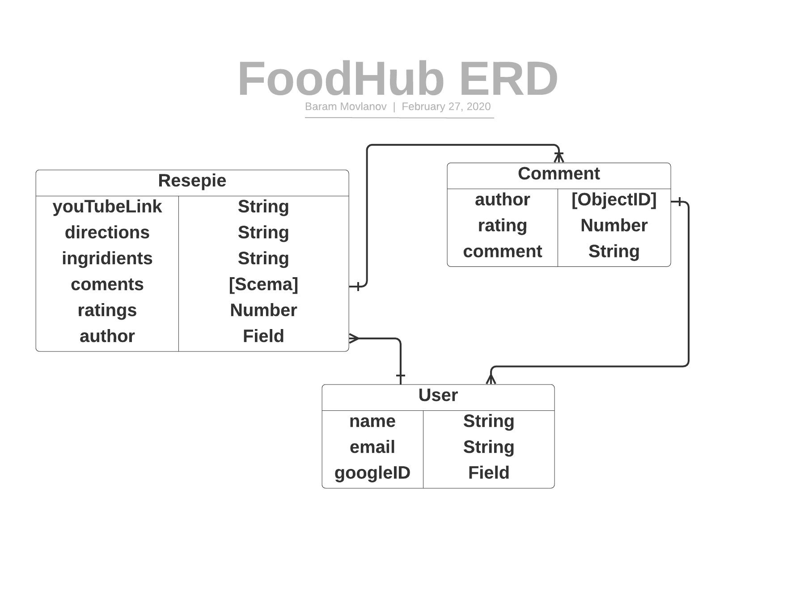

## SEI-Project-2-FoodHub
SEI CC 07 Project 2 
# FoodHub
by Bahram Movlanov

**FoodHub App**
This is recipes storing app. This app allows users to save favourite recipes from YouTube. Users allowed to share, comment and rate recipes

 **Screenshots**
    App screenshots:

    ERD Schemas

    

  
 **Technologies Used**:
 This app is build using following technologies:
 Node.JS
  expressJS
  ejs
    
 **Getting Started**: Include a link to the deployed app and your Trello board with the project's planning.
  
 **Next Steps**: Planned future enhancements (icebox items).
